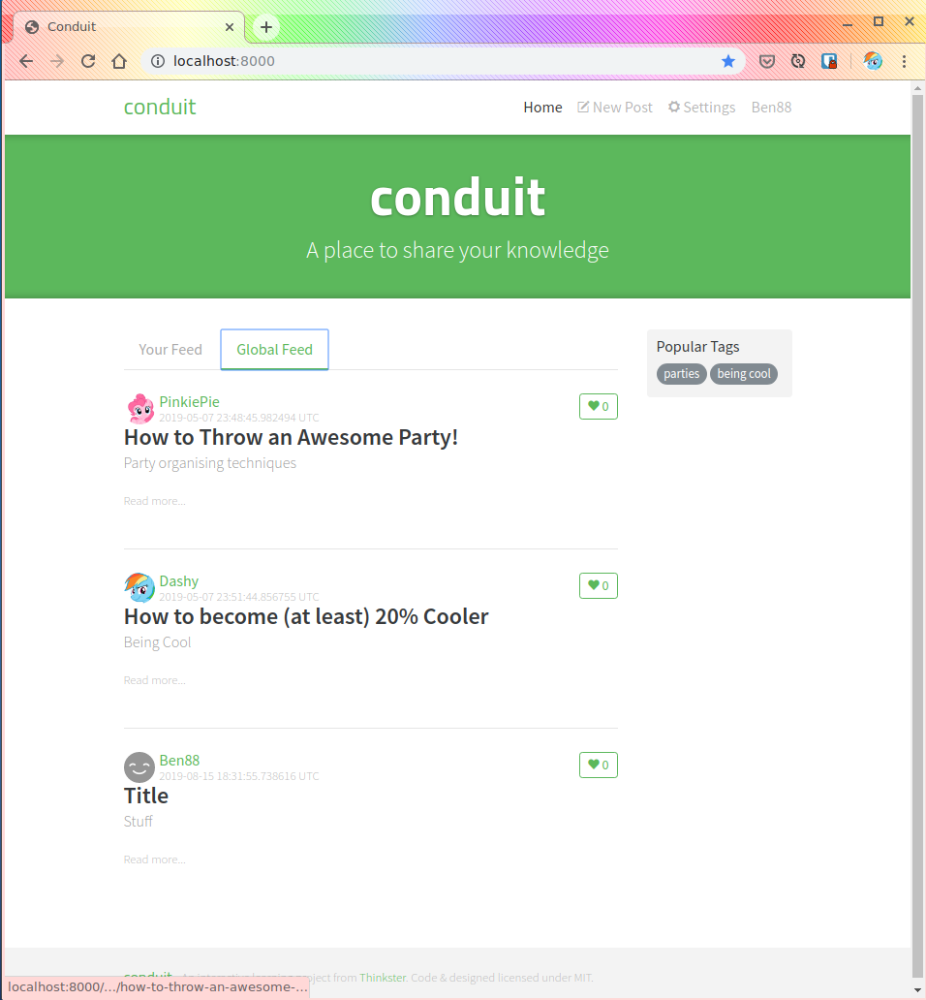

# 

> ### Reflex codebase containing real world examples (CRUD, auth, advanced patterns, etc) that adheres to the [RealWorld](https://github.com/gothinkster/realworld) spec and API.


### [Demo](https://github.com/gothinkster/realworld)&nbsp;&nbsp;&nbsp;&nbsp;[RealWorld](https://github.com/gothinkster/realworld)


This codebase was created to demonstrate a fully fledged fullstack application built with **Reflex** including CRUD operations, authentication, routing, pagination, and more.

We've gone to great lengths to adhere to the **Reflex** community styleguides & best practices.

For more information on how to this works with other frontends/backends, head over to the [RealWorld](https://github.com/gothinkster/realworld) repo.


# How it works

> Describe the general architecture of your app here

# Getting started

You'll need two things to get up and running. A postgres database with the schema up in it and obelisk (the build tool for obelisk applications).

## Obelisk

This step will require nix, so if you are just dipping your toes in the water and don't have nix already, you may want to consider downloading a NixOS virtualbox appliance from [here](https://nixos.org/nixos/download.html).

Once you have an environment with nix up and running, please follow the obelisk installation instructions: 
https://github.com/obsidiansystems/obelisk/#installing-obelisk

## Postgres Database

This code is shipped with a default config in ./config/backend/pgConnStr expects a postgres database running on localhost:5442 with a username and password of conduit/conduit. 

Note:this is *NOT* best practice to ship secrets in your git repo. In this case our two secrets don't matter too much, but you should avoid copying this bit if you cargo-cult it.

### Docker

If your already have docker, a super easy way to get a database up and running already populated with the schema and some test data is by running the following command:

```
docker run -p 5432:5432 benkolera/reflex-realworld-workshop-pg:latest
```

Please note that if you have postgres already running on this machine that this command will fail because docker can't open port 5432 on your machine. Change the command to `-p 5433:5432` but don't forget to update config/backend/pgConnStr with the new port. 

If you aren't familar with docker but you are with postgres, please follow the next step instead.

### Postgres Setup

If you aren't already familar with docker but are comfortable with postgres, you probably just want to create the database directly! :)

Jump into your database as a superuser and run:
```sql 
CREATE USER conduit WITH LOGIN PASSWORD 'conduit'; 
CREATE DATABASE conduit OWNER conduit;
```

This assumes that users connecting from localhost can password auth. You may have to change your postgres auth config to make this work or do something completely different and update ./config/backend/pgConnStr accordingly. 

Quit from this session and test the credentials by running the database restore to your new db:
> psql -h localhost -U conduit conduit -f db.sql 

### Running the app

Assuming that you have obelisk installed, a postgres database with the schema in it running and that the ./config/backend/pgConnStr settings point to your database, then you are good to go! 

Run:
```
ob run
```

This will download a bunch of stuff but then hopefully display:
```
About to test the db connection. If ob run dies, check out config/backend/pgConnStr
Frontend running on http://localhost:8000/
```

If you hit http://localhost:8000 in chrome (not firefox or safari or edge: it's a limitation of the dev environment at the moment), you should see . 
